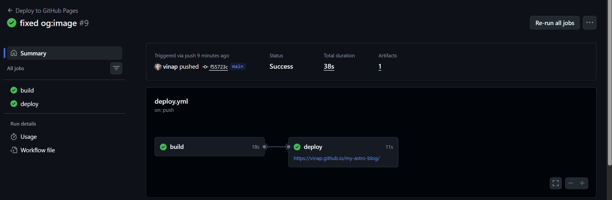

If you're tired of manually building your project and uploading files, **GitHub Actions** is the answer. It's like having a personal assistant that lives in your repository and handles all the "boring" deployment tasks every time you save your code.

## What exactly is a GitHub Action?

Think of it as a **Virtual Machine (VM)**. Every time you push code to GitHub, a fresh Linux computer wakes up, downloads your code, installs your tools (like Node.js), builds your site, and pushes it live.

---

## Step 1: Create the "Instructions" Folder

GitHub looks for its instructions in a very specific place. In your project's root folder, create these folders:

1. Create a folder named `.github` (the dot at the start is important).
2. Inside that, create another folder named `workflows`.
3. Inside `workflows`, create a file named `deploy.yml`.

Your structure should look like:
```
your-project/
├── .github/
│   └── workflows/
│       └── deploy.yml
├── src/
├── package.json
└── ...
```

---

## Step 2: The Logic (The .yml File)

Here is a solid, friendly breakdown of the code you need to paste into that `deploy.yml` file.

```yaml
name: Build and Deploy Site

# When should this "assistant" wake up?
on:
  push:
    branches: ["main"] # Only run when I push to the main branch

# Give the assistant permission to write to your GitHub Pages
permissions:
  contents: read
  pages: write
  id-token: write

jobs:
  build_and_deploy:
    runs-on: ubuntu-latest # The type of virtual computer to use

    steps:
      # 1. Copy the code from GitHub to the virtual machine
      - name: Checkout Code
        uses: actions/checkout@v4

      # 2. Install Node.js (Crucial for modern frameworks like Astro 6)
      - name: Setup Node.js
        uses: actions/setup-node@v4
        with:
          node-version: 22 # Use 22 to avoid "Unsupported Engine" errors

      # 3. Install your project dependencies
      - name: Install Dependencies
        run: npm install

      # 4. Build the project
      - name: Build Project
        run: npm run build

      # 5. Hand the final 'dist' folder to GitHub Pages
      - name: Upload Artifact
        uses: actions/upload-pages-artifact@v3
        with:
          path: ./dist # This is the folder created by the build command

      # 6. Final step: Make it live!
      - name: Deploy to GitHub Pages
        id: deployment
        uses: actions/deploy-pages@v4
```

---

## Step 3: Update your Repository Settings

Even with the file in place, GitHub won't deploy until you give it the "Green Signal."

1. Go to your repository on **GitHub.com**.
2. Click on **Settings** (the gear icon).
3. On the left sidebar, click **Pages**.
4. Under **Build and deployment** > **Source**, click the dropdown and select **"GitHub Actions"**.

---

## Step 4: The Build Test

Now, just commit your changes and push to GitHub:

```bash
git add .
git commit -m "chore: setup github actions"
git push origin main
```

Now, click the **Actions** tab at the top of your GitHub page. You'll see a yellow spinning circle. This is GitHub following your checklist. If everything is correct, it will turn into a **Green Checkmark** in a minute or two.

Here's what a successful deployment looks like:



As you can see, both the **build** and **deploy** jobs completed successfully (green checkmarks), and your site is now live!

---

## Common Troubleshooting for Indian Devs

- **The "Node" Error:** If you see an error about `Node version`, it's because the virtual machine is using an old version. Ensure your `.yml` file says `node-version: 22`.
- **The "Blank Screen" (CSS Missing):** If your site is live but has no styling, it's usually a path issue. Make sure your project config knows it is living in a subfolder (like `/my-astro-blog/`).
- **Permissions Denied:** If the build fails at the "Deploy" step, double-check that you gave the Action `write` permissions in the `.yml` file.

---

## The Result

Automation is a one-time effort that saves you thousands of "manual" minutes. Now, every time you write a new post, just push it, and GitHub handles the rest!

Your deployment pipeline is now automated, reliable, and hands-free. Welcome to the future of deployment! 🚀
