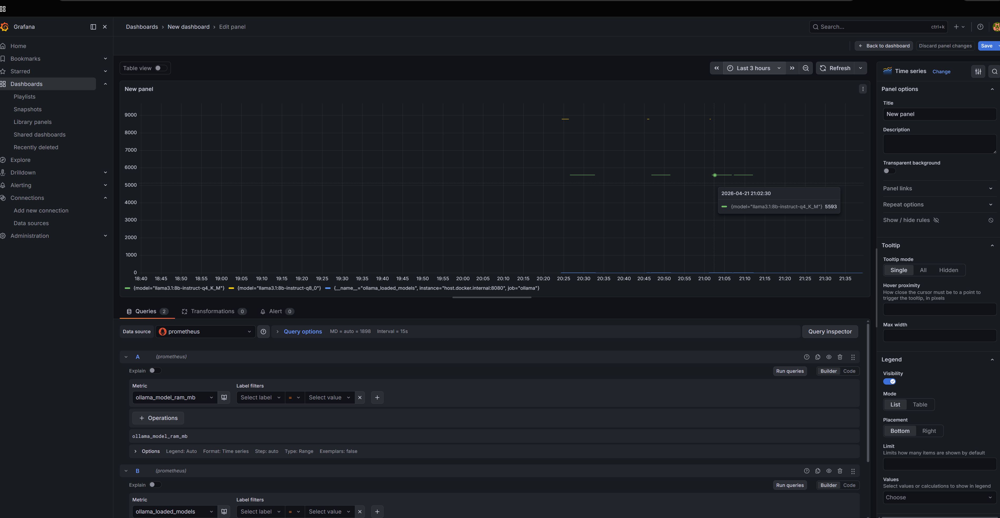
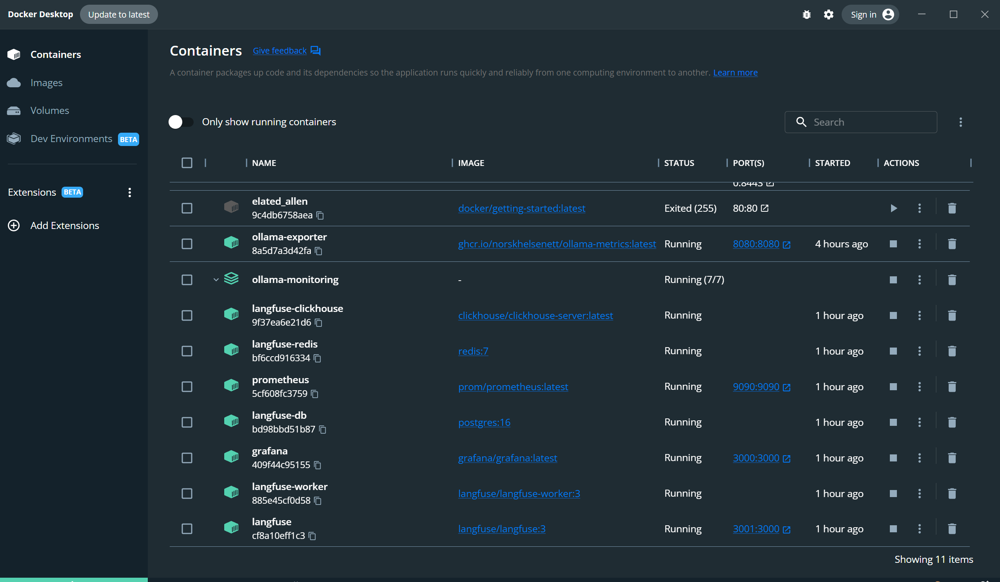
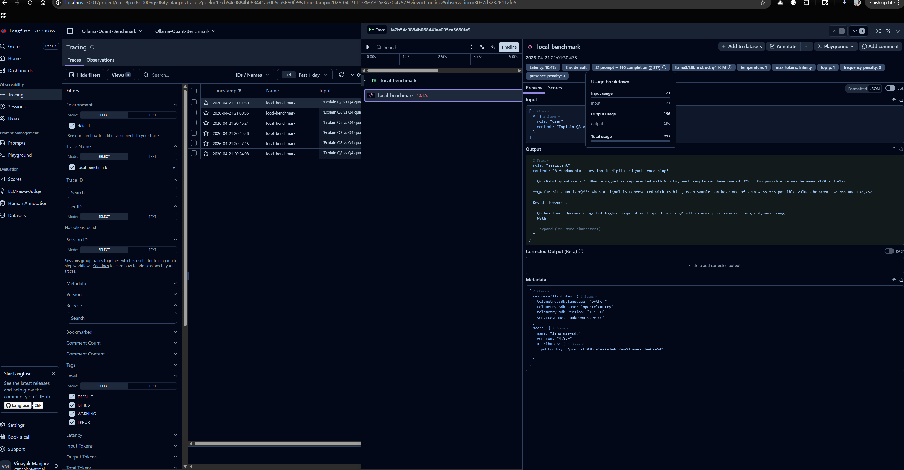

 
## Quantization Benchmarking with Langfuse v3, Prometheus, and Grafana

In LLM engineering, the transition from "it works on my machine" to "it works efficiently" requires data. When testing different quantization levels of Llama 3.1, you need to monitor the relationship between System Resources (VRAM/RAM) and Model Throughput (Tokens/Sec).
This guide details a professional-grade observability stack running entirely in Docker, designed to benchmark local LLM performance.

### 1. The Infrastructure Blueprint

Our stack is divided into three layers: the Inference Engine, the Analytical Trace Store, and the Metric Aggregator.

#### The Service Mesh (Docker Compose)

The Langfuse v3 architecture is significantly more robust than previous versions, moving to a distributed model for high performance:
- **Langfuse & Worker:** The langfuse container handles the UI and API, while the langfuse-worker handles background tasks (like processing traces and calculating costs).
- **Analytical Layer:** We use Clickhouse—a columnar database—to store trace data. This allows for near-instant filtering of thousands of LLM runs.
- **Persistence Layer:** Postgres 16 manages users, projects, and metadata.
- **Caching Layer:** Redis 7 facilitates communication between the app and the worker.

### Prometheus Configuration
To capture the rapid "spikes" in memory when Ollama loads a model, we reduced the `scrape_interval` to 5s. This provides high-resolution data in Grafana.

#### YAML Configuration:
```yaml
global:
  scrape_interval: 5s 

scrape_configs:
  - job_name: 'ollama'
    static_configs:
      - targets: ['host.docker.internal:8080'] # Ollama-exporter sidecar
```

### 2. The Python Benchmarking Logic
To ensure our traces are accurate, we use the `langfuse.openai` wrapper. This automatically instruments the OpenAI-compatible endpoint provided by Ollama.
**Key Technical Detail:** We implemented a `langfuse.get_client().flush()` call. Since Langfuse exports traces asynchronously to prevent blocking the main application, the `flush()` ensures that even in short-lived benchmarking scripts, no data is lost before the script terminates.

#### Python Script:
```python
def run_benchmark(model_name):
    print(f"--- Benchmarking: {model_name} ---")
    start_time = time.time()
    response = client.chat.completions.create(
        model=model_name,
        messages=[{"role": "user", "content": "Explain Q8 vs Q4 quantization briefly."}],
        name="quantization-comparison", # Group traces in Langfuse
        metadata={"quantization": model_name.split('-')[-1]}
    )
    # Force upload of trace data
    langfuse.get_client().flush()
    print(f"Completed {model_name} in {round(time.time() - start_time, 2)}s")
default
```
## 4. Verification: The "Success" State

After running the benchmark script, we can verify the integration across the three core layers of our stack.

### Hardware Monitoring (Grafana)
The following dashboard captures the real-time RAM allocation on the i7-11800H as Ollama swaps between the Q8 and Q4 models. Notice the distinct 8.5GB and 4.8GB plateaus.



### Container Orchestration (Docker)
The service mesh remains stable. Here we see the health status of the Langfuse Worker, Clickhouse, and Postgres containers, confirming that the asynchronous trace-offloading is not bottlenecking the local CPU.



### Trace Observability (Langfuse)
Finally, the Langfuse UI confirms successful ingestion. Each sequential call is captured as a distinct trace, documenting the exact token consumption and Time to First Token (TTFT) for each quantization level.

