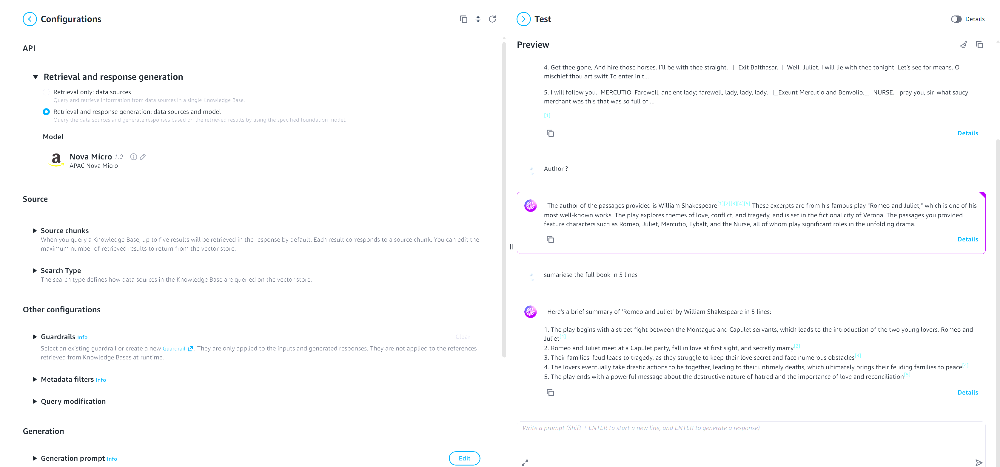

I’ve built P2P products, scaled data, and handled more production fires than I can count. But as I started diving into **Retrieval-Augmented Generation (RAG)**, I wasn't thinking about the "magic" of AI. I was thinking like an architect: **"How much is this going to bleed my AWS budget?"**

Most tutorials point you toward OpenSearch or Pinecone. They’re great, but they have a "standing cost"—meaning you pay just to let them sit there. As a dev from India, my mindset is always: **Why pay a fixed fee when I can pay-as-I-go?**

I wanted a solution that scales to zero when I'm not using it. So, I ignored the big databases and went with **Amazon S3 Vectors**.

### Step 1: The "Senior" Choice (1024 Dimensions)

The setup was simple on paper: drop a PDF in S3, let Bedrock "read" it, and store the vectors back in an S3 bucket.

I picked **Titan Text Embeddings v2** and locked it to **1024 dimensions**.

- **The Logic:** Titan v2 is smart enough to handle smaller dimensions, but since I'm using S3 for storage, the "extra weight" of 1024 costs basically nothing.
- I wanted high-fidelity retrieval without the infrastructure headache.

### Step 2: The IAM "Whack-a-Mole" (The Real Struggle)

AWS IAM wouldn't surprise me. I was wrong. Bedrock Knowledge Bases is a whole different beast.

I hit the wall immediately with that classic error:

```text
User: ... is not authorized to perform: iam:PassRole
```

I spent a good hour playing "Whack-a-Mole" with permissions. You can't just throw `AdminAccess` at this and hope it works. I had to manually configure Trust Relationships for the Bedrock service and explicitly allow `iam:PassRole`.

**The Lesson:** Even if you're a senior dev, AWS will humble you. Don't use wildcards (`*`) in your roles. Scope them to the specific Knowledge Base ARN. It’s a pain to set up, but it’s the only way to build production-grade stuff.

### Step 3: The Best Part? The $0.00 Bill

The most satisfying part of this whole project? Checking the billing dashboard.

- **The Model:** I used **Amazon Nova Micro**. It’s lightning fast and costs pennies per million tokens.
- **The Storage:** By using S3 Vectors, I’m only paying for the data on the "disk," not a server sitting idle.
- **The Safety Net:** I set up a **Zero-Spend Budget** alert. If anything starts ticking up, I get an email before I lose even 1 Rupee.

### Step 4: Proof of Work

Once the "Sync Completed" turned green, I tested it with a specific question about the author of the PDF. The result? **Verified Citations.**

Seeing those little `[1]` and `[2]` citations is the "Gold." It proves the AI isn't just hallucinating; it’s actually citing the source chunks from my S3 bucket.

### Final Thoughts

Transitioning to AI doesn't mean forgetting your backend roots. In fact, knowing how to keep infrastructure secure and cost-effective is what separates a senior engineer from a beginner.

**What’s next?** I’m looking at **Agentic AI**—where the model doesn't just read the document, but actually takes action based on it.

*If you’re wrestling with Bedrock permissions or trying to keep your AWS bill at zero, let’s talk in the comments.*

---

**#AWS #GenAI #AmazonBedrock #RAG #Serverless #BackendEngineering #S3Vectors**
